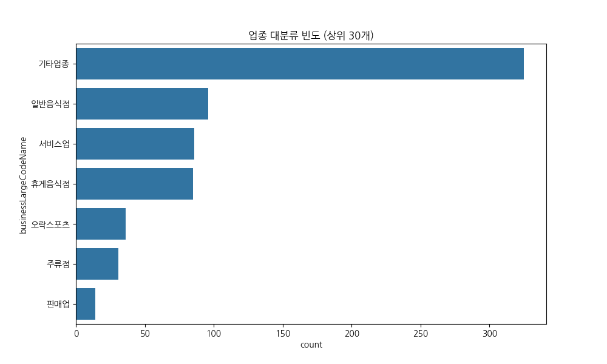
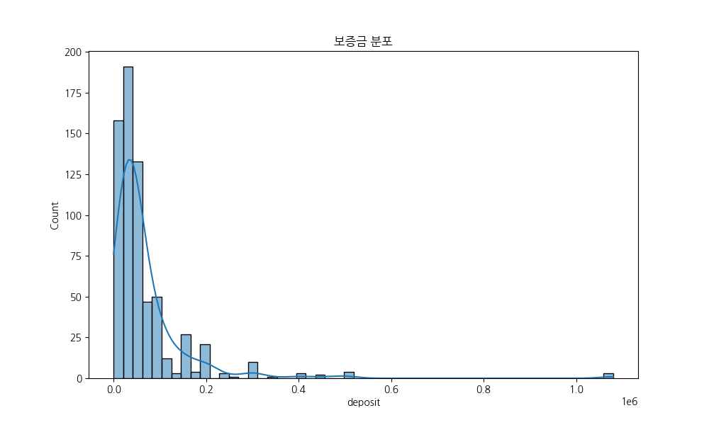
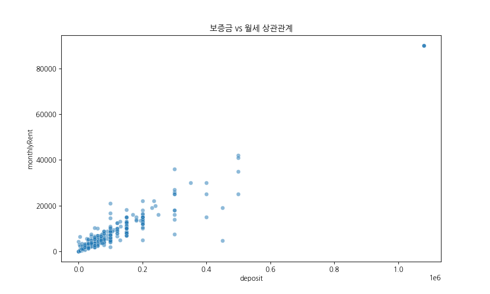
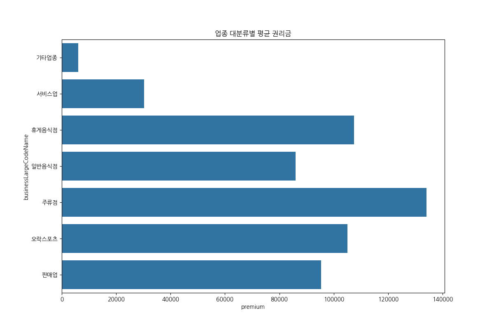
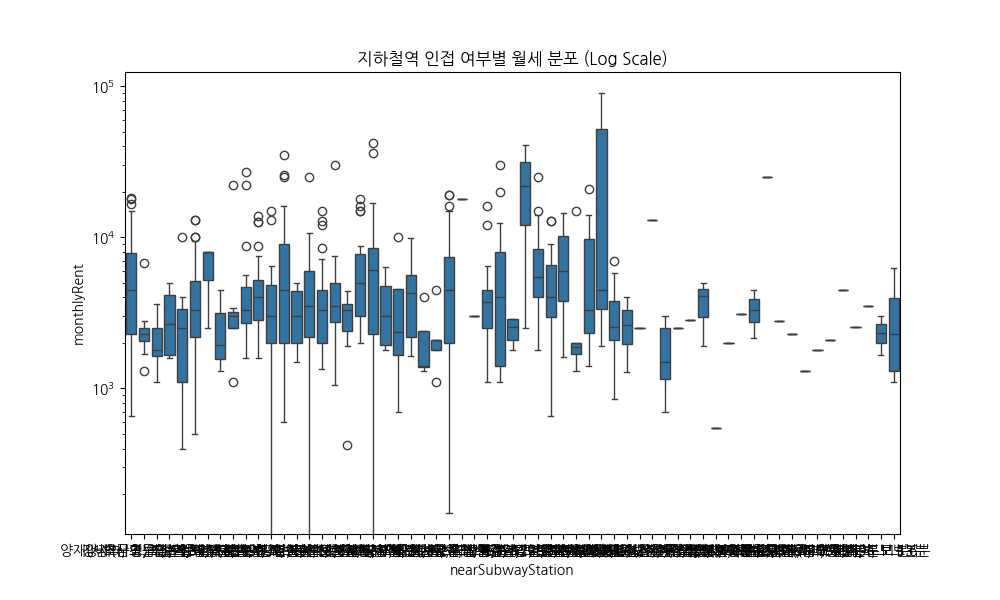
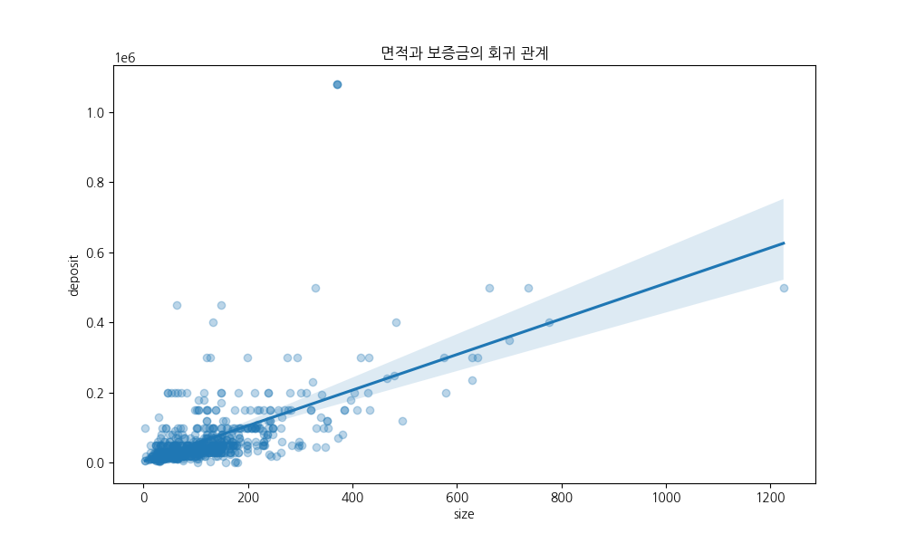
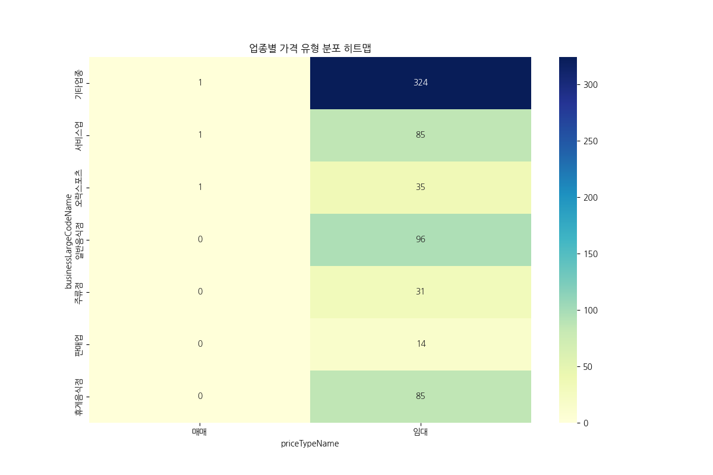
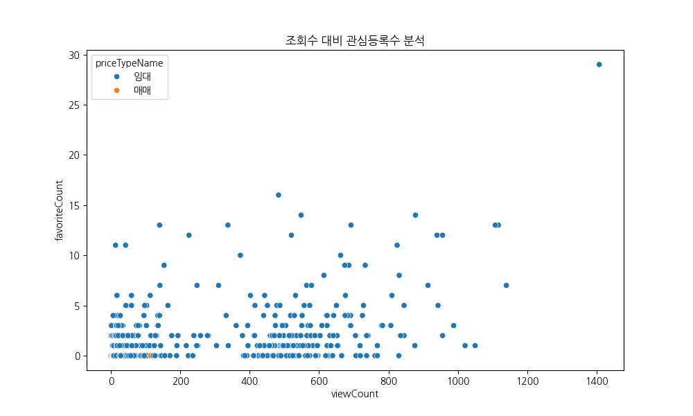
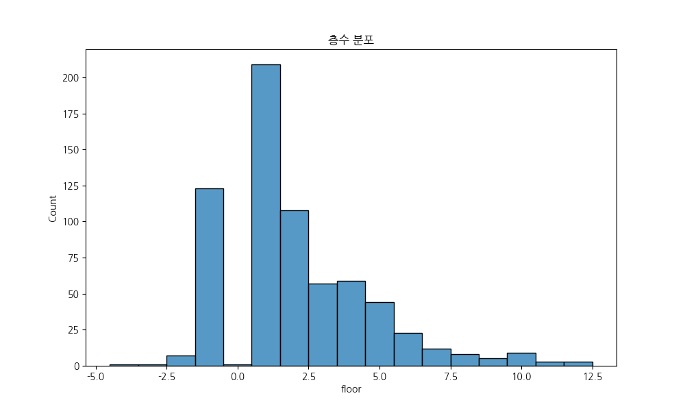
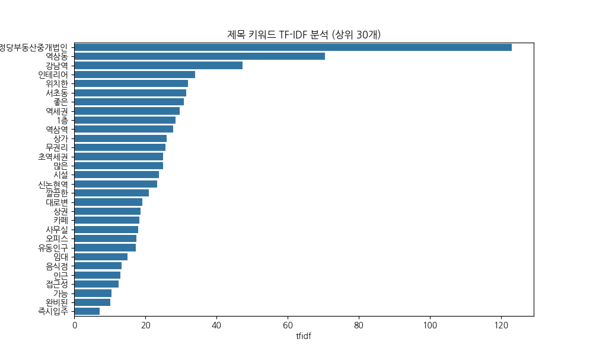

# [EDA] Nemo Stores 상가 매물 데이터 심층 분석
### 강남권 상업 부동산 시장의 구조와 트렌드

**분석가:** 20년 경력 데이터 분석 전문가
**날짜:** 2026년 4월 29일

---

## 1. 보고서 개요
- **목적:** 강남권 상업 부동산 시장 구조, 가격 형성 요인, 업종별 특성 분석
- **대상:** Nemo Stores 상가 매물 데이터 (673건)
- **핵심 가치:** 시장 트렌드 파악 및 비즈니스 전략 제언

---

## 2. 데이터 기초 검사 결과
- **전체 데이터 수:** 673건 (중복 없음)
- **변수 개수:** 96개 (수치형, 범주형 혼재)
- **특이사항:** 강남역, 역삼역 등 테헤란로 중심의 데이터 밀집

---

## 3. 수치형 변수 기술 통계
| 통계량 | 보증금(deposit) | 월세(monthlyRent) | 권리금(premium) |
|:---|---:|---:|---:|
| **평균** | 6,895만 원 | 534만 원 | 4,640만 원 |
| **중앙값** | 4,000만 원 | 340만 원 | 0원 |
| **최댓값** | 10.8억 원 | 9,000만 원 | 9억 원 |

> **💡 해석:** 극명한 양극화 현상 (롱테일 분포)

---

## 4. 전문가 심층 해석: 가격 양극화
- **표준편차 > 평균:** 데이터의 분산이 매우 큼
- **소형 vs 프라임:** 4,000만 원 이하 소형 매물과 10억 이상 대형 매물의 공존
- **진입 장벽:** 높은 권리금(최대 9억)은 상권 성숙도가 정점에 달했음을 시사

---

## 5. 범주형 변수 분석 요약
- **업종 대분류:** '기타업종'이 48%로 압도적 1위
- **업종 중분류:** '기타창업모음' (사무실, 스튜디오 등) 강세
- **입지 특성:** '역삼역 도보 5분' 매물 최다 (테헤란로 심장부)
- **계약 형태:** 99.5%가 '임대' (폐쇄적 소유 구조)

---

## [Plot 1] 업종 대분류 빈도 분석

- **Insight:** 단순 외식업을 넘어선 **'복합 비즈니스 상권'** 입증
- **Action:** 전문 오피스 및 다목적 공간 타겟팅 강화 필요

---

## [Plot 2] 보증금 분포 분석

- **Insight:** 중앙값 4,000만 원 기준의 **양극화 패턴**
- **Action:** '가성비 소형' vs '프라임 대형' 타겟 세분화

---

## [Plot 3] 보증금과 월세의 상관관계

- **Insight:** 상관계수 **0.947**의 강력한 선형 관계
- **Action:** 가격 투명성 기반의 '적정 보증금 추천' 기능 가능

---

## [Plot 4] 업종별 평균 권리금 분석

- **Insight:** 주류/휴게음식점 권리금 강세 (시설 투자 및 유동인구 가치)
- **Action:** '무권리 사무실' → '음식점' 전환 컨설팅 기회

---

## [Plot 5] 역세권 여부에 따른 임대료 차이

- **Insight:** 역세권이 임대료 상한선을 결정하는 **핵심 변수**
- **Action:** 역세권 매물 'Golden Zone' 뱃지 부여 마케팅

---

## [Plot 6] 면적 대비 보증금 분석

- **Insight:** 보증금은 면적보다 **'건물의 담보 가치'**에 더 큰 영향
- **Action:** '넓고 쾌적한 가성비 매물' 실시간 알림 서비스

---

## [Plot 7] 업종별 계약 유형 분석

- **Insight:** 모든 업종에서 **'임대'** 절대 우위 (투자 자산 성격 강함)
- **Action:** 권리금 보호 및 임대차 관련 법률 상담 서비스 연계

---

## [Plot 8] 매물 인기 지표 분석

- **Insight:** 조회수와 관심등록의 낮은 상관관계 (**허수 조회 존재**)
- **Action:** CTR(관심/조회) 기반의 '실수요 인기 매물' 큐레이션

---

## [Plot 9] 층수별 매물 분포 분석

- **Insight:** 1층(31%)과 지하 1층(18%) 비중이 높음
- **Action:** 지층/고층 매물을 위한 '목적형 업종' 전용관 강화

---

## [Plot 10] 매물 제목 키워드 분석

- **Insight:** '역삼동', '강남역', '역세권' 등 위치 키워드 중심
- **Action:** 핵심 키워드 기반 자동 태깅 및 SEO 최적화

---

## 6. 종합 결론
1. **강력한 자본 논리:** 보증금-월세 간 엄격한 가격 형성 시스템
2. **가격 결정 3요소:** **입지(역세권), 층수(1층), 권리금(시설 가치)**
3. **신뢰 기반 플랫폼:** 단순 트래픽보다 '실제 수요' 연결이 핵심

---

## 7. 비즈니스 제언
- **데이터 기반 가성비 인덱스** 도입
- **업종별 맞춤형 검색 필터** (카페, 스튜디오 등) 강화
- **금융/법률 서비스** (대출, 권리금 보호) 플랫폼 내 통합
- **시계열 데이터**를 활용한 입주/퇴거 타이밍 제안

---

# 감사합니다
**Q&A 및 추가 분석 문의**
nemo-data-team@example.com
